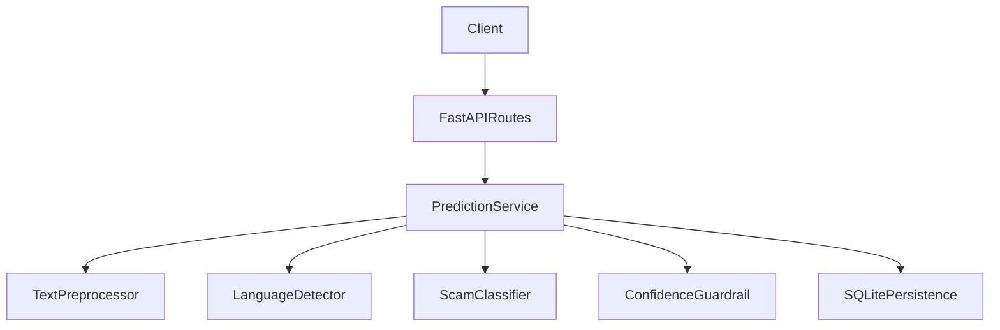

# Architecture

## Overview
Phase 1 implements a clean backend architecture for text scam detection with swappable ML inference.

## Layers
- **API Layer** (`backend/api`): request validation and HTTP responses.
- **Service Layer** (`backend/services`): workflow orchestration and persistence.
- **Model Layer** (`backend/models`): classifier, translation hook, confidence guardrail.
- **Data Layer** (`backend/database`): SQLite schema and connection lifecycle.
- **Utility Layer** (`backend/utils`): constants, logging, helper methods.

## Classification Flow
1. API receives a text payload.
2. Text is normalized and language-detected.
3. Classifier runs:
   - transformer checkpoint path if available
   - fallback deterministic classifier otherwise
4. Guardrail maps confidence to risk band.
5. Prediction is persisted to `predictions` and `history`.
6. If confidence is in review band, entry is created in `review_queue`.

## Extensibility
- `TranslatorService` is a stable hook for multilingual translation improvements.
- `ScamClassifier` supports direct checkpoint loading from `ml/checkpoints`.
- SQLite can be replaced by another store by changing the data layer only.
